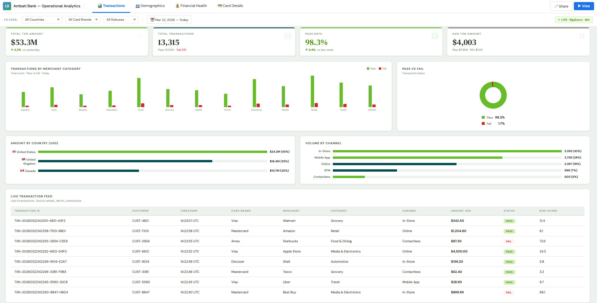
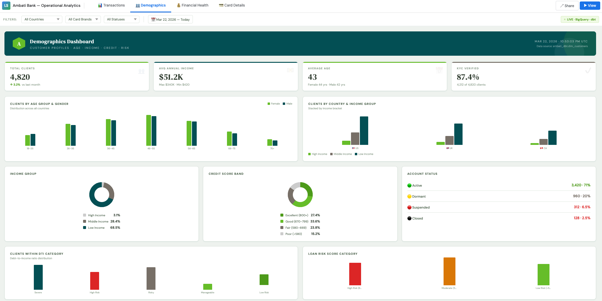
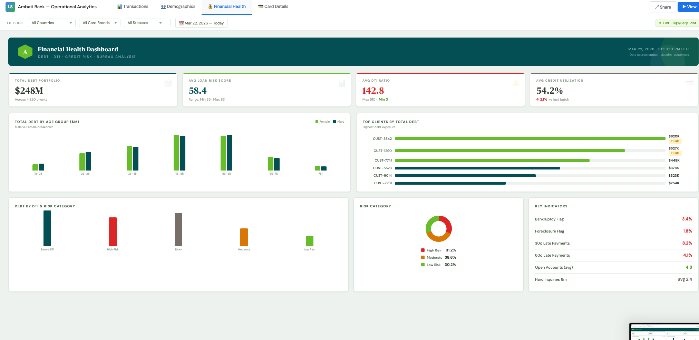
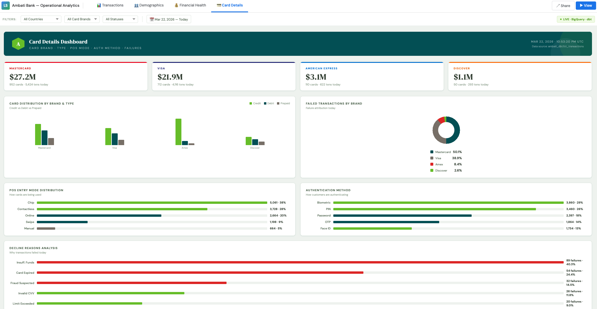

<div align="center">


<br/>
<br/>

# Real-Time Banking Analytics Pipeline

**A production-grade end-to-end data engineering pipeline built on Google Cloud Platform**  
*Simulating real-time banking operations across US 🇺🇸 · UK 🇬🇧 · Canada 🇨🇦*

<br/>


<br/>
<br/>

[](/)
[](/)
[](/)
[](/)
[](/)

</div>

---

## 📋 Table of Contents

- [Overview](#overview)
- [Architecture](#architecture)
- [Tech Stack](#tech-stack)
- [Project Structure](#project-structure)
- [Data Model](#data-model)
- [Schema Design](#schema-design)
- [Pipeline Flow](#pipeline-flow)
- [Getting Started](#getting-started)
- [dbt Models](#dbt-models)
- [Dashboard](#dashboard)
- [Future Enhancements](#future-enhancements)

---

## 📸 Dashboard Preview

| Transactions | Demographics |
|---|---|
|  |  |

| Financial Health | Card Details |
|---|---|
|  |  |

---

## Overview

Ambati Bank is a **fictional multi-national bank** used to simulate a real-time data engineering pipeline. The system ingests banking events (transactions + clickstream) at 1 event/second, validates them via Avro schema, streams them into BigQuery, transforms them with dbt, and visualises them in Looker Studio.

**Key highlights:**
- ⚡ **Real-time streaming** — Pub/Sub ingests 1 transaction + 1 clickstream event per second
- 🔐 **Schema enforcement** — Avro schemas defined in Pub/Sub topics. Publisher uses **fastavro** to encode messages as Avro binary locally. Missing primary keys are caught by fastavro before the message is sent
- 🔄 **Incremental models** — dbt only processes new rows on each run, not the full table
- 🏦 **Multi-country** — Covers US, UK and Canada with currency-aware transactions
- 📊 **4-page dashboard** — Transactions · Demographics · Financial Health · Card Details
- 🧪 **Data quality** — dbt SAFE_CAST handles type casting with warn-only tests so pipeline never breaks

---

## Architecture

```
┌─────────────────────────────────────────────────────────────────────┐
│                         DATA SOURCES                                │
│                                                                     │
│   Core Banking          Mobile & Web App        Batch (Hourly)      │
│   US · UK · Canada      Clickstream Events       Customers + Bureau │
└────────┬───────────────────────┬──────────────────────┬────────────┘
         │                       │                      │
         ▼                       ▼                      ▼
┌─────────────────────────────────────────────────────────────────────┐
│                         INGESTION LAYER                             │
│                                                                     │
│   publisher.py                                                      │
│   ├── Generates event as Python dict                                │
│   ├── fastavro validates + encodes to Avro binary LOCALLY           │
│   │   └── Missing primary key → ValueError, message never sent      │
│   └── Valid binary message → published to Pub/Sub topic             │
│                                                                     │
│   ┌─────────────────────┐   ┌─────────────────────┐                │
│   │  Pub/Sub Topic      │   │  Pub/Sub Topic      │                │
│   │  ambati-transactions│   │  ambati-clickstream │                │
│   └──────────┬──────────┘   └──────────┬──────────┘                │
│              │                         │                            │
│              ▼ BigQuery subscription   ▼ BigQuery subscription      │
└─────────────┬───────────────────────────┬──────────────────────────┘
              │                           │
              ▼                           ▼
┌─────────────────────────────────────────────────────────────────────┐
│                      STORAGE LAYER (BigQuery)                       │
│                                                                     │
│   Dataset: ambati_ops  (Raw Landing)                                │
│   ┌─────────────────┐  ┌─────────────────┐  ┌──────────────────┐  │
│   │ transactions_raw│  │ clickstream_raw │  │  customers_raw   │  │
│   │ 45 cols         │  │ 34 cols         │  │  34 cols         │  │
│   │ partition: day  │  │ partition: day  │  │  partition: day  │  │
│   │ cluster: country│  │ cluster: country│  │  cluster: country│  │
│   │ card_brand,status│ │ channel,device  │  │  account_status  │  │
│   └─────────────────┘  └─────────────────┘  └──────────────────┘  │
│                                               ┌──────────────────┐  │
│                                               │ credit_bureau_raw│  │
│                                               │ 42 cols          │  │
│                                               └──────────────────┘  │
└─────────────────────────────┬───────────────────────────────────────┘
                              │
                              ▼
┌─────────────────────────────────────────────────────────────────────┐
│                   TRANSFORMATION LAYER (dbt)                        │
│                                                                     │
│   Dataset: ambati_dbt                                               │
│                                                                     │
│   ┌── staging/ (views) ──────────────────────────────────────┐     │
│   │  stg_transactions   SAFE_CAST + clean + type all cols     │     │
│   │  stg_clickstream    SAFE_CAST + clean + type all cols     │     │
│   │  stg_customers      Deduplicated on latest batch_date     │     │
│   │  stg_credit_bureau  Deduplicated + derived risk bands     │     │
│   └───────────────────────────────┬──────────────────────────┘     │
│                                   │                                 │
│   ┌── intermediate/ (views) ──────▼──────────────────────────┐     │
│   │  int_customer_360   Customer + Credit Bureau LEFT JOIN    │     │
│   └───────────────────────────────┬──────────────────────────┘     │
│                                   │                                 │
│   ┌── marts/ (incremental tables) ▼──────────────────────────┐     │
│   │  fct_transactions   Enriched txns · unique_key: txn_id   │     │
│   │  fct_clickstream    Enriched events · unique_key: event_id│    │
│   │  dim_customers      Full customer 360 profile             │     │
│   │  mart_txn_summary   Daily aggregates · last 3 days        │     │
│   └──────────────────────────────────────────────────────────┘     │
└─────────────────────────────┬───────────────────────────────────────┘
                              │
                              ▼
┌─────────────────────────────────────────────────────────────────────┐
│                    VISUALISATION (Looker Studio)                     │
│                                                                     │
│   Page 1: Transactions    Page 2: Demographics                      │
│   Page 3: Financial Health  Page 4: Card Details                    │
│                                                                     │
│   Theme: Huntington Bank Colors                                     │
│   Primary: #034F54 (Deep Teal) · Accent: #66BD29 (Green)           │
└─────────────────────────────────────────────────────────────────────┘
```

---

## Tech Stack

| Layer | Technology | Purpose |
|---|---|---|
| **Cloud** | Google Cloud Platform | Infrastructure |
| **Streaming** | Google Pub/Sub | Real-time event ingestion |
| **Schema** | Avro (fastavro) | Message validation + binary encoding |
| **Quarantine** | Pub/Sub Dead Letter + Cloud Storage | Failed message handling |
| **Warehouse** | BigQuery | Storage + query engine |
| **Transform** | dbt (ELT pattern) | Type casting, cleaning, enrichment |
| **Orchestration** | Manual / dbt CLI | Run scheduling |
| **Visualisation** | Looker Studio | Dashboards |
| **Language** | Python 3.12 | Publisher, setup scripts |
| **Storage** | Cloud Storage | Batch landing + dead letter |

---

## Project Structure

```
ambank-bank-analytics/
│
├── 📄 publisher.py               # Real-time event publisher (1/sec)
├── 📄 setup_bigquery.py          # Creates BigQuery tables + schemas
├── 📄 create_schemas.py          # Creates Avro schemas in Pub/Sub
├── 📄 wire_pubsub_bigquery.py    # Wires Pub/Sub → BigQuery + dead letter
├── 📄 batch_generator.py         # Generates customer + credit bureau CSV
├── 📄 test_quarantine.py         # Tests dead letter quarantine
├── 📄 ambati_bank_report.html    # Standalone dashboard (all 4 pages)
├── 📄 .gitignore
├── 📄 README.md
│
└── 📁 ambati_dbt/                # dbt project
    ├── 📄 dbt_project.yml
    ├── 📄 profiles.yml
    └── 📁 models/
        ├── 📁 staging/
        │   ├── 📄 sources.yml
        │   ├── 📄 staging.yml
        │   ├── 📄 stg_transactions.sql
        │   ├── 📄 stg_clickstream.sql
        │   ├── 📄 stg_customers.sql
        │   └── 📄 stg_credit_bureau.sql
        ├── 📁 intermediate/
        │   └── 📄 int_customer_360.sql
        └── 📁 marts/
            ├── 📄 marts.yml
            ├── 📄 fct_transactions.sql
            ├── 📄 fct_clickstream.sql
            ├── 📄 dim_customers.sql
            └── 📄 mart_txn_summary.sql
```

---

## Data Model

### Raw Layer — `ambati_ops`

| Table | Rows | Partition | Cluster | Cols |
|---|---|---|---|---|
| `transactions_raw` | ~13K+ (live) | `timestamp` DAY | `country, card_brand, status` | 45 |
| `clickstream_raw` | ~13K+ (live) | `timestamp` DAY | `country, channel, device_type` | 34 |
| `customers_raw` | 500 (batch) | `batch_date` DAY | `country, account_status` | 34 |
| `credit_bureau_raw` | 500 (batch) | `batch_date` DAY | `risk_category, credit_score_band` | 42 |

### dbt Layer — `ambati_dbt`

| Model | Type | Unique Key | Description |
|---|---|---|---|
| `stg_transactions` | View | — | SAFE_CAST + clean transactions |
| `stg_clickstream` | View | — | SAFE_CAST + clean clickstream |
| `stg_customers` | View | — | Deduplicated on latest batch |
| `stg_credit_bureau` | View | — | Deduplicated + derived bands |
| `int_customer_360` | View | — | Customer + bureau joined |
| `fct_transactions` | Incremental Table | `transaction_id` | Enriched with customer data |
| `fct_clickstream` | Incremental Table | `event_id` | Enriched with customer data |
| `dim_customers` | Table | `customer_id` | Full 360 customer profile |
| `mart_txn_summary` | Incremental Table | composite | Daily aggregates (last 3 days) |

---

## Schema Design

> **Design philosophy:** Never reject data at ingestion. Store raw as strings, cast safely in dbt, flag failures as warnings not errors.

```
Field Type              Raw (BigQuery)      Staging (dbt)       Marts (dbt)
──────────────────────  ──────────────────  ──────────────────  ─────────────
transaction_id          STRING REQUIRED     STRING              STRING
customer_id             STRING REQUIRED     STRING              STRING
timestamp               TIMESTAMP REQUIRED  TIMESTAMP           TIMESTAMP
processing_date         DATE                DATE                DATE
amount                  STRING NULLABLE     SAFE_CAST → FLOAT64 FLOAT64
is_flagged              STRING NULLABLE     CASE WHEN → BOOL    BOOL
risk_score              STRING NULLABLE     SAFE_CAST → FLOAT64 FLOAT64
card_expiry_year        STRING NULLABLE     SAFE_CAST → INT64   INT64
```

**Why store everything as STRING in raw?**
- `SAFE_CAST` in dbt returns `NULL` instead of crashing on bad data
- Cast failures are tracked with `_cast_failed` boolean flag columns
- Dead letter quarantine handles structural failures (missing PKs, unknown fields)
- Raw layer becomes a perfect audit trail — nothing ever changes

---

## Pipeline Flow

### Real-Time Path
```
1.  publisher.py generates Python dict (transaction or clickstream event)
2.  fastavro validates schema locally and encodes to Avro binary:
    ├── Missing primary key (transaction_id, customer_id)
    │   → ValueError raised by fastavro → message never sent to Pub/Sub
    └── Valid message → Avro binary bytes published to Pub/Sub topic
3.  BigQuery subscription reads from Pub/Sub topic
4.  Row written to transactions_raw / clickstream_raw in BigQuery
```

### Batch Path
```
1.  batch_generator.py generates 500 customers + 500 credit bureau rows
2.  Uploads CSV to gs://ambati-raw-landing/customers/ and /credit_bureau/
3.  BigQuery load job reads from Cloud Storage → lands in raw tables
```

### Transformation Path
```
1.  dbt run staging/*    → creates typed views (SAFE_CAST all fields)
2.  dbt run intermediate/* → creates customer 360 joined view
3.  dbt run marts/*      → incremental merge into fact + summary tables
4.  dbt test             → warns on data quality issues (severity: warn)
```

---

## Getting Started

### Prerequisites

```bash
pip install \
  google-cloud-pubsub \
  google-cloud-bigquery \
  google-cloud-storage \
  fastavro \
  dbt-bigquery
```

### Environment Setup

```bash
export GOOGLE_APPLICATION_CREDENTIALS=/path/to/service-account-key.json
```

### One-Time Setup

```bash
# 1. Create BigQuery dataset + 4 raw tables (partitioned + clustered)
python setup_bigquery.py

# 2. Create Avro schemas in Pub/Sub
python create_schemas.py

# 3. Wire Pub/Sub → BigQuery + dead letter quarantine
python wire_pubsub_bigquery.py
```

### Run the Pipeline

```bash
# Terminal 1 — Start real-time publisher (1 event/sec)
python publisher.py

# Terminal 2 — Load batch data
python batch_generator.py

# Terminal 3 — Run dbt transformations
cd ambati_dbt
dbt run
dbt test

# Terminal 4 — Test quarantine
python test_quarantine.py
```

---

## dbt Models

### Useful Commands

```bash
# Run all models
dbt run

# Run specific layer
dbt run --select staging.*
dbt run --select marts.*

# Run single model
dbt run --select fct_transactions

# Full rebuild (first time only)
dbt run --full-refresh

# Run tests
dbt test

# Run + test together
dbt build

# Generate and view documentation
dbt docs generate && dbt docs serve
```

### Test Coverage

All mart models have dbt tests with `severity: warn` — tests flag issues without blocking the pipeline:

| Model | Tests |
|---|---|
| `dim_customers` | `customer_id` unique + not_null · `country` accepted_values · `credit_band` validated |
| `fct_transactions` | `transaction_id` unique + not_null · `status` accepted_values · `card_brand` validated |
| `fct_clickstream` | `event_id` unique + not_null · `channel` accepted_values · `device_type` validated |
| `mart_txn_summary` | All composite key cols not_null · `status` accepted_values |

Test windows:
- `dim_customers` — last 7 days
- `fct_transactions` / `fct_clickstream` — last 7 days
- `mart_txn_summary` — last 30 days

---

## Dashboard

**Theme:** Huntington Bank brand colors
| Color | Hex | Usage |
|---|---|---|
| Deep Teal | `#034F54` | Sidebar, headers, primary backgrounds |
| Huntington Green | `#66BD29` | Accents, positive metrics, charts |
| Dark Silver | `#776F67` | Secondary text, neutral elements |
| Charcoal | `#333333` | Body text |

**4 pages:**

| Page | Data Source | Key Charts |
|---|---|---|
| 📊 **Transactions** | `mart_txn_summary` + `fct_transactions` | KPIs · Merchant category · Pass/fail · Channel breakdown · Live feed |
| 👥 **Demographics** | `dim_customers` | Age/gender · Income groups · Credit score bands · Account status |
| 💰 **Financial Health** | `dim_customers` | Debt portfolio · DTI analysis · Risk categories · Top clients |
| 💳 **Card Details** | `fct_transactions` | Brand performance · Card types · POS modes · Auth methods · Declines |

> 📄 A standalone HTML version of the dashboard is available at `ambati_bank_report.html` — open in any browser, works fully offline.

---

## GCP Resources

| Resource | Name |
|---|---|
| Project | `ambati-bank-analytics` |
| Service Account | `ambati-publisher-sa` |
| Pub/Sub Topics | `ambati-transactions` · `ambati-clickstream` |
| Dead Letter Topics | `ambati-transactions-dead-letter` · `ambati-clickstream-dead-letter` |
| Avro Schemas | `ambati-transactions-schema` · `ambati-clickstream-schema` |
| BigQuery Dataset (raw) | `ambati_ops` |
| BigQuery Dataset (dbt) | `ambati_dbt` |
| Cloud Storage | `gs://ambati-raw-landing/` |

---

## Future Enhancements

- [ ] **Dataflow** — Complex stream transformations (sessionization, ML scoring)
- [ ] **BigQuery Continuous Queries** — Real-time aggregations without dbt
- [ ] **Cloud Composer** — Orchestrate hourly batch loads with Airflow DAGs
- [ ] **dbt Cloud** — Scheduled runs, alerts, hosted documentation
- [ ] **Vertex AI** — Fraud detection ML model on transaction features
- [ ] **Column-level security** — PII protection on SSN, email, phone fields
- [ ] **Multi-region** — Data residency compliance for UK/Canada regulations
- [ ] **Great Expectations** — Data quality framework alongside dbt tests

---

## Security

> ⚠️ The service account key (`*.json`) is **gitignored** and must **never** be committed to version control.

- All credentials loaded via `GOOGLE_APPLICATION_CREDENTIALS` environment variable
- SSN field treated as sensitive PII — handle with care in production
- BigQuery column-level security recommended for production deployments
- Cloud Storage dead letter bucket should be access-controlled

---

<div align="center">

Built by **Nikhil Ambati** · March 2026

`GCP` · `Pub/Sub` · `BigQuery` · `dbt` · `Looker Studio` · `Python` · `fastavro` · `Avro`

⬡ Powered by Huntington Green

</div>
